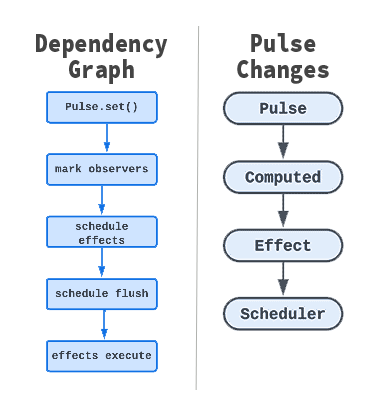

<p style="text-align: Left;"></p>


**ICTUS** is a minimal, high‑performance fine‑grained reactive runtime built around signals, computed values, and deterministic scheduling. It is designed as a framework‑agnostic reactive engine that can power UI frameworks, state managers, and reactive data pipelines.

ICTUS combines ideas from Solid signals, MobX, Angular Signals, and React scheduler priorities. ICTUS uses a small deterministic runtime with priority lanes.

### High Level Principals

- **Simplicity** - The runtime is intentionally small and understandable.
- **Determinism** - Reactive updates always occur in a predictable order.
- **Performance** - Fine‑grained dependency tracking ensures minimal work.
- **Composability** - Signals, computed values, and effects can be combined freely.

Most signal systems focus purely on **dependency tracking**.
ICTUS achieves competitive performance because it uses:

• Array based observer lists  
• Lazy computed evaluation  
• Minimal runtime allocations  
• Deterministic scheduler

### Potential use cases:

• UI frameworks  
• concurrent rendering engines  
• real‑time dashboards  
• reactive simulation systems


# Core Features

• Fine‑grained reactivity  
• Signals for mutable state  
• Lazy computed values  
• Reactive effects  
• Deterministic scheduler with priority lanes  
• Very small runtime footprint  
• Framework‑agnostic design


# Installation

```bash
npm install ICTUS
# or
yarn add ICTUS
```


# Examples

### Basic Idea
```ts
import { signal, computed, effect } from "ICTUS";
const count = pulse(0);
const doubled = computed(() => count.get() * 2);

effect(() => {
  console.log("count:", count.get());
  console.log("double:", doubled.get());
});
count.set(1);

// Output:
count: 1;
double: 2;
```

### Pulse

**Pulse** represents s reactive mutable state. Reading a signal automatically tracks dependencies.

```ts
const count = pulse](0)
count.get()
count.set(1)
```

### Computed Values

Computed values derive state from signals.

Properties:

• lazy evaluation  
• automatic dependency tracking  
• cached until dependencies change

```ts
const total = computed(() => price.get() * qty.get());
```


### Effects

Effects execute side effects when dependencies change.

```ts
effect(() => {
  console.log(count.get());
});
```

---

# Architecture Overview

ICTUS builds a **reactive dependency graph**. Only the necessary parts of the graph update.

<p style="text-align: Left;"></p>

<br>

# Reactive Nodes (Internal Architecture)
ICTUS's runtime is composed of a small set of primitives.

Three node types form the dependency graph:

| Node Type    | Purpose        |
| ------------ | -------------- |
| PulselNode   | mutable state  |
| ComputedNode | derived values |
| EffectNode   | side effects   |

Dependency tracking occurs automatically during execution.

Example:

```
PulseNode → ComputedNode → EffectNode
```

---

## Dependency Tracking

Dependencies are captured using an active observer context.

```
activeObserver
```

When a signal is read during computation:

```
signal.get()
   ↓
register activeObserver
```

This forms the reactive graph dynamically.

---

## Scheduler

ICTUS uses a **deterministic scheduler with priority lanes**.

```
SYNC
USER
TRANSITION
BACKGROUND
```

Flush order:

```
SYNC
  ↓
USER
  ↓
TRANSITION
  ↓
BACKGROUND
```

This guarantees stable execution and enables advanced scheduling strategies.

---

# Reactive Graph Example

When `count` changes:

```
count.set()
   ↓
invalidate doubled
   ↓
schedule logger
   ↓
run logger
```

Only the affected nodes update.

---

# Advanced Examples

## Derived State Graph

```ts
const price = pulse(10);
const qty = pulse(2);

const subtotal = computed(() => price.get() * qty.get());
const tax = computed(() => subtotal.get() * 0.07);
const total = computed(() => subtotal.get() + tax.get());

effect(() => {
  console.log("total =", total.get());
});
```

---

## Multiple Effects

```ts
effect(() => console.log("count:", count.get()));
effect(() => console.log("double:", doubled.get()));
```

Each effect independently subscribes to dependencies.

---

## Reactive Data Pipeline

ICTUS can also power data flows.

```ts
const raw = pulse(10);

const normalized = computed(() => raw.get() / 100);
const percent = computed(() => normalized.get() * 100);
effect(() => {
  console.log(percent.get() + "%");
});
```

---


# Project Status

ICTUS is currently **early stage**.

The architecture is stable but internal optimizations will continue to evolve.

---

# License

MIT
